## Documentation

<b>Step 1</b> - Click the green download button to get the stencyl id.net extension.

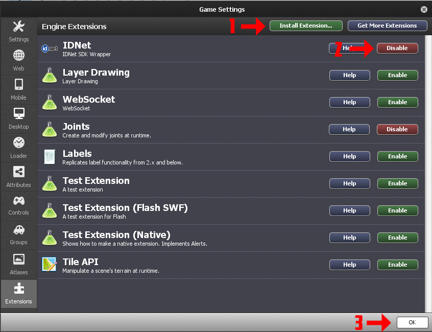

Then install it and you'll see new code blocks.

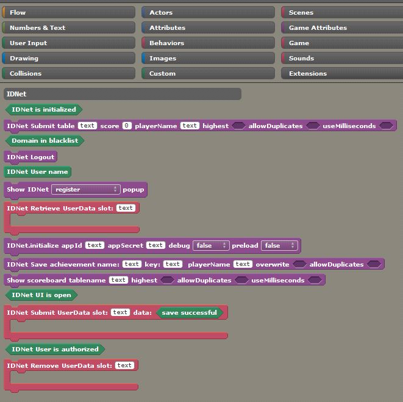


<b>Step 2</b> - You should have 3 different scenes.

 1. To load local saves (loadScene)
 2. For banned sites (lockedScene)
 3. To load online saves (mainMenu)
 
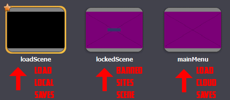
 
Duplicate the game attributes you want to save in cloud (use the prefix "cloud" - it's useful)
 
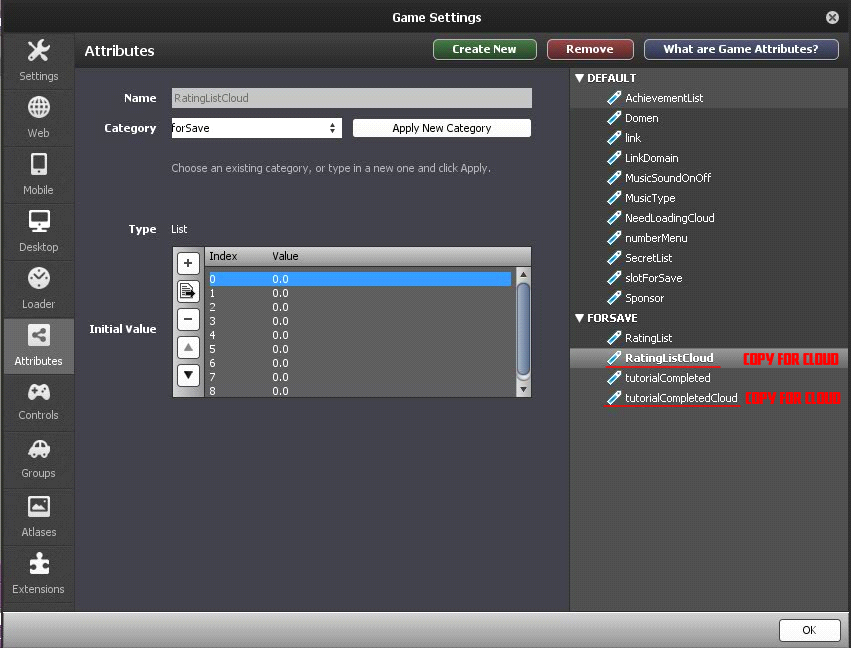
 
 
<b>Step 3</b> - Scene: loadScene

Example code for loading local saves

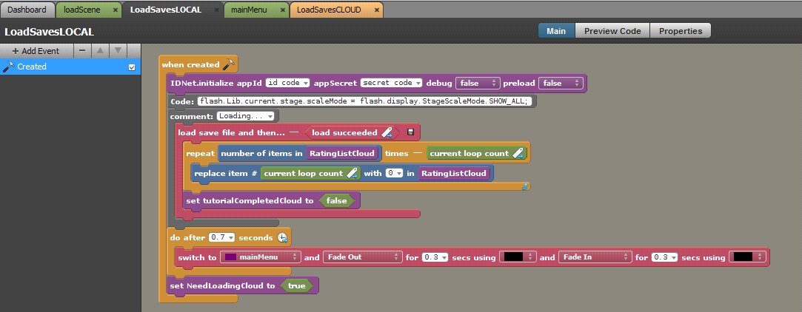

First, we must initialize the app. After loading, set your game attributes with the prefix "cloud" as default. This is an important part. Also, create a game attribute `NeedLoadingCloud`.


<b>Step 4</b> - Scene: mainMenu

Example code for loading id.net saves.


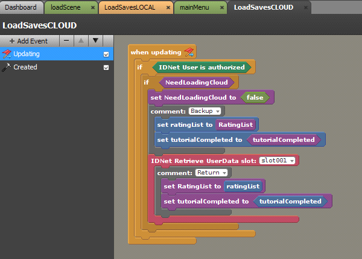

This code should be in for the update event. Before loading, you must save your non-cloud game attributes in local attributes (create local-blue attributes for it), and after loading use local-blue attributes to feed in their respective saved values. This is very important.

Use the following code for banned sites.


<b>Step 5</b> - Example code for saving (id.net and local).

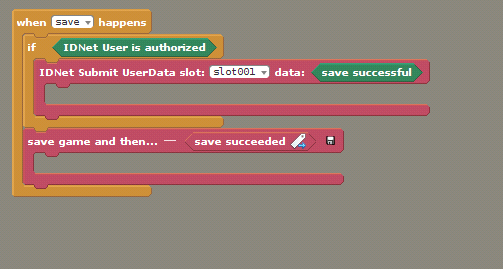


<b>Step 6</b> - Example code for unlocking achievements.

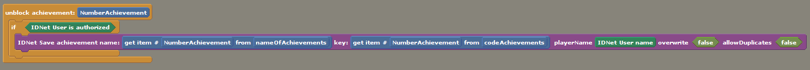

To display the achievements menu.

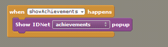


<b>Step 7</b> - Example code for submitting high scores

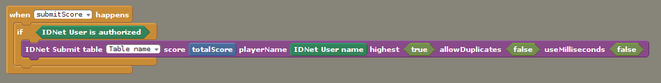

To show the high scores menu.

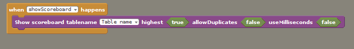


<b>Step 8</b> - Example code for any menu button which might be covered by id.net UI

First, we must check if a id.net UI is open or not.

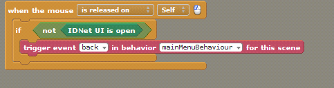
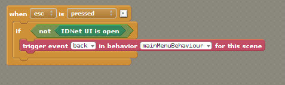


<b>Step 9</b> - Example code for choosing save type (local or id.net)

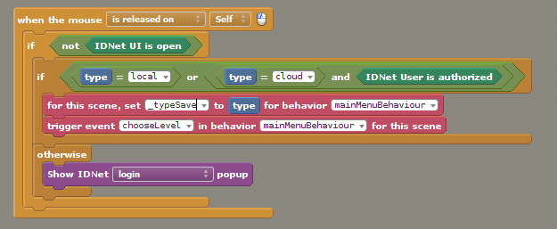

<b>Step 10</b> - LockedScene

A LockedScene can look something like this.

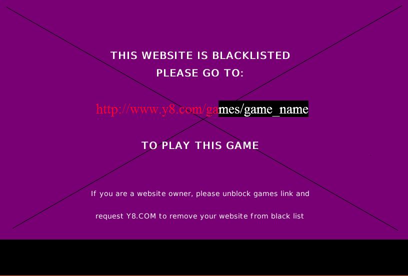

Add actor to the lockedScene.

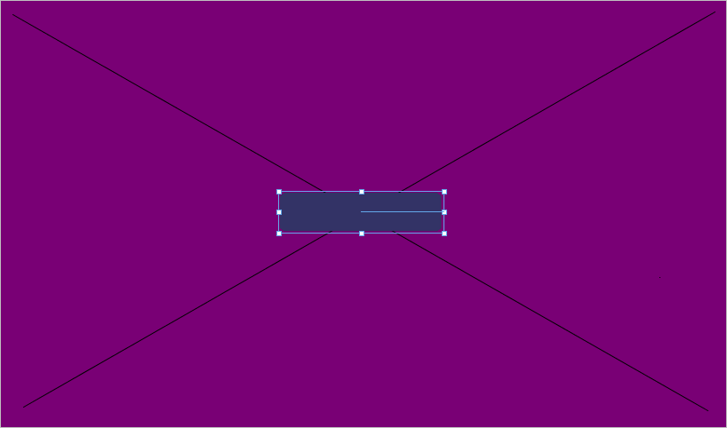

Example code for this actor. This code lets the player highlight and copy/paste the correct game link in their browser.

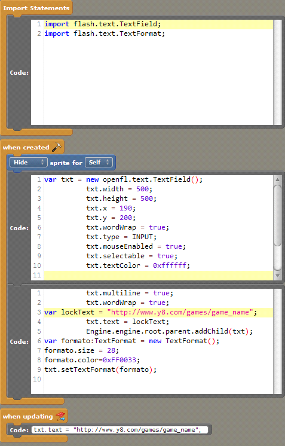


```
//import:
import flash.text.TextField;
import flash.text.TextFormat;

//created:
var txt = new openfl.text.TextField();
		txt.width = 500;
		txt.height = 500;
		txt.x = 190;
		txt.y = 200;
		txt.wordWrap = true;
		txt.type = INPUT;
		txt.mouseEnabled = true;
		txt.selectable = true;
		txt.textColor = 0xffffff;
		txt.multiline = true;
		txt.wordWrap = true;
var lockText = "http://www.y8.com/games/game_name";
		txt.text = lockText;
		Engine.engine.root.parent.addChild(txt);
var formato:TextFormat = new TextFormat();
formato.size = 28;
formato.color=0xFF0033;
txt.setTextFormat(formato);

//updated:
txt.text = "http://www.y8.com/games/game_name"; 
```
